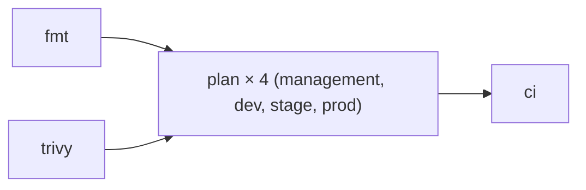

# aws-infra

Managing Otto's AWS infrastructure using [OpenTofu](https://opentofu.org), following [AWS Organizations best practices](https://docs.aws.amazon.com/organizations/latest/userguide/orgs_best-practices.html).

See [CLAUDE.md](CLAUDE.md) for conventions, account structure, and bootstrap status.

## CI

The `ci` job is required to pass before merging to `main`, enforced by the org-level ruleset in [github-settings](https://github.com/ojhermann-org/github-settings). `fmt` and `trivy` run in parallel, then `plan` runs across all four account directories as a matrix, then `ci` gates on all of them.

